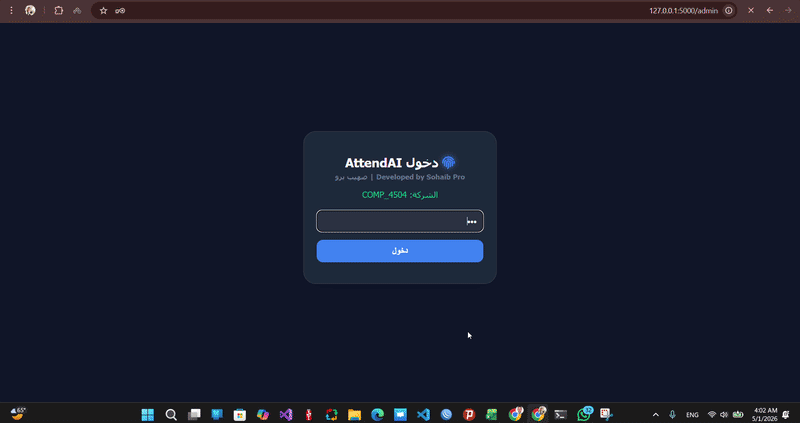

# نظام تسجيل الحضور والانصراف الذكي بالبصمة 👋

---

## 📸 نظرة عامة (مشاهدة الفيديو/الصور)

  <!-- استبدل اسم الصورة بالأسفل باسم الملف الذي رفعته للمستودع، مثلاً demo.gif -->
  

---

## 🛠️ وصف المشروع

هو نظام متكامل (Desktop Application) مبني باستخدام لغة Python لإدارة الحضور والانصراف بشكل مؤتمت بالاعتماد على التحقق من البصمة من هاتف الموظف بتطبيق فلاتر  مربوط بسريال الهاتف الخاص . النظام مصمم لرفع كفاءة إدارة الموارد البشرية وضمان دقة البيانات.

---

## ✨ المميزات الرئيسية

*   🔒 **تحقق آمن:** دمج أجهزة استشعار البصمة للتحقق من هوية الموظفين بشكل لحظي ودقيق.
*   📊 **لوحة تحكم للمسؤول:** إدارة كاملة للموظفين، إضافة المستخدمين الجدد، ومراجعة سجلات الحضور.
*   🔄 **قاعدة بيانات لحظية (Real-time):** مزامنة لحظية للبيانات مع Firebase (Real-time Database).
*   📋 **تقارير مفصلة:** إمكانية تصدير تقارير يومية وشهرية دقيقة.
*   💼 **واجهة مستخدم احترافية:** واجهة مستخدم نظيفة وبديهية مصممة باستخدام مكتبات الـ Python لسهولة الاستخدام.

---

## ⚙️ التقنيات المستخدمة

*   🐍 **لغة البرمجة:** Python
*   🔥 **قاعدة البيانات/الخلفية:** Firebase
*   🖥️ **واجهة المستخدم:** Python Desktop Libraries
*   🔒 **الأمن:** Fingerprint SDK Integration

---

> **ملاحظة:** الكود المصدري لهذا المشروع خاص (Private) ولا يمكن عرضه لأسباب أمنية وتجارية. هذا المستودع مخصص لاستعراض واجهة المشروع وإمكانياته ومميزاته البرمجية فقط.
